# 🎓 Estudos de Sistema Operacional (SO)

Este repositório reúne meus estudos sobre **Sistema Operacional**, aprendidos na faculdade, e minha prática com **Mermaid** para criar fluxogramas 🚀

---

## 🖥️ Sistema Operacional e os 4 Componentes

Aqui está um diagrama mostrando os principais componentes de um sistema computacional:

```mermaid
flowchart TD
    A(["Sistema Operacional (SO)"]) --> n1["Quais são os 4 componentes de um sistema computacional?"]
    
    n1 --> n2["💻 Hardware"]
    n1 --> n3["⚙️ Sistema Operacional"]
    n1 --> n4["📂 Programas Aplicativos"]
    n1 --> n5["👤 Usuários"]

    n2 --> n6["Parte física do computador: CPU, Memória RAM, Teclado, Mouse, Impressora."]
    n3 --> n7["Gerencia o hardware e coordena os aplicativos."]
    n4 --> n8["Softwares usados para resolver problemas ou realizar tarefas."]
    n5 --> n9["Quem interage com o sistema: pessoas, máquinas ou outros computadores."]
```

```mermaid
flowchart TD
    intro["📝 Este diagrama mostra como o usuário interage com o Sistema Operacional e executa diferentes aplicativos ao mesmo tempo, como Steam 🎮 e Spotify 🎵."]
    U["👤 Usuário"] --> SO["🖥️ Sistema Operacional (SO)"]

    SO --> H["⚙️ Hardware"]
    SO --> A1["🎮 Steam (Jogando)"]
    SO --> A2["🎵 Spotify (Música)"]

    H --> CPU["🧮 CPU"]
    H --> RAM["💾 Memória RAM"]
    H --> GPU["🎨 Placa de Vídeo"]
    H --> Audio["🔊 Placa de Som"]

    A1 -->|usa| CPU
    A1 -->|usa| GPU
    A1 -->|usa| RAM

    A2 -->|usa| CPU
    A2 -->|usa| RAM
    A2 -->|usa| Audio
```

