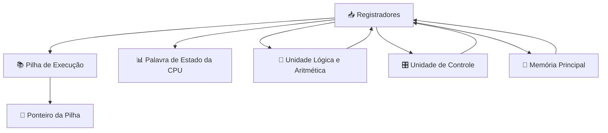

# 🖥️ Processador de Registradores

---

### Explicação detalhada

- **Registradores 📥** → Memória interna rápida da CPU, armazena dados temporários.  
- **Pilha de Execução 📚** → Guarda variáveis temporárias e endereços de retorno de funções.  
- **Ponteiro da Pilha 📌** → Indica o topo da pilha, controla onde dados serão lidos ou escritos.  
- **Palavra de Estado da CPU 📊** → Contém flags que indicam o resultado das operações e o estado da CPU.  
- **Unidade Lógica e Aritmética 🧮** → Realiza operações matemáticas e lógicas usando dados dos registradores.  
- **Unidade de Controle 🎛️** → Coordena o fluxo de instruções e controla quais registradores e unidades executar.  
- **Memória Principal 🧠** → A CPU lê e escreve dados temporários na memória, interagindo com os registradores.  

---

